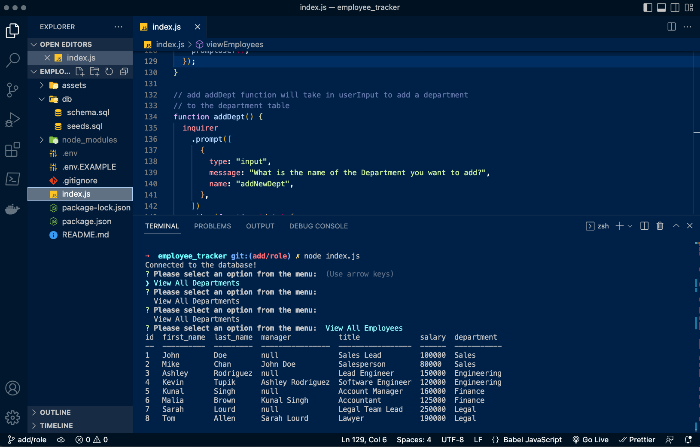

# employee_tracker

A command-line application from scratch to manage a company's employee database, using Node.js, Inquirer, and MySQL.

## Description

This is a command-line application from scratch to manage a company's employee database, using Node.js, Inquirer, and MySQL.

## Installation

### Prerequisites-local machine

This CLI app uses Node.js, Inquirer, and MySQL so you will need to install all of these.

## Usage

**Project setup**

- Clone down this repository locally
  `git clonegit@github.com:westgards/employee_tracker.git`
- You will need to install
  - `nvm`
  - `npm`
  - `mysql`
- Setup a mysql database
- Use the `.env.EXAMPLE` file an setup your credentials

**Use the below command to run the CLI app locally**
`node server.js`

## Features

- Command Line Application that takes in employee information
- Asynchonous query calls to MySQL database

## Demo Video
Short clip of the demo!

https://user-images.githubusercontent.com/87400584/215019822-94cb6fd0-7662-4b96-be94-e74f6d321527.mov

## Credits

Tutorials:

- [U of MN Coding Bootcamp Link](https://github.com/coding-boot-camp)
